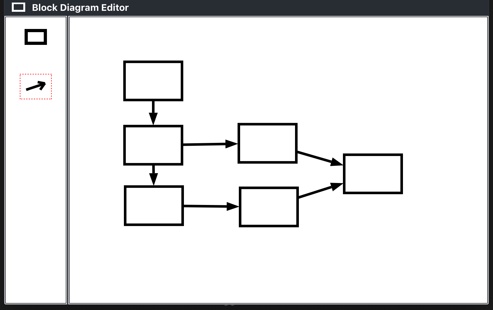

# Block Diagram Editor

Hobby project to learn react.  A block diagram editor that lets you add blocks and join them with arrows.  Click on the canvas to add a block.  Click on the block to delete it.  Use arrows to connect the blocks.  Still under development (haven't added arrow tips yet).

<p  align="center">
    
</p>


Initial setup
```
npm install
```

Run
```
npm start
```
Open [http://localhost:3000](http://localhost:3000) to view it in the browser.
